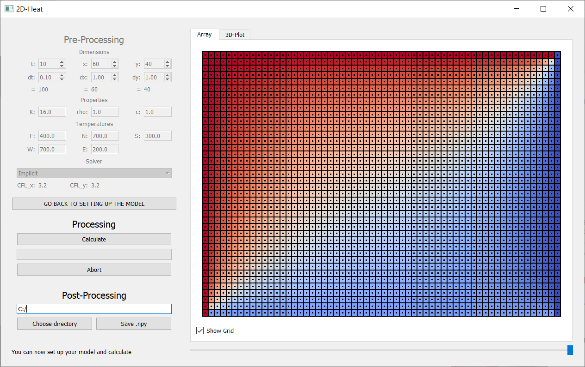

# 2D Heatflux Simulation

> **HINWEIS:**
> Diese 2D-Wärmeleitungssimulation wurde im Rahmen der Veranstaltung "Objektorientierte Simulationsmethoden
> in der Thermo- und Fluiddynamik" (Institut für Thermodynamik, TU Braunschweig) erstellt.

> **NOTE:**
> This 2D heat conduction simulation was created in the course "Object-oriented simulation methods 
> in Thermodynamics and Fluid Dynamics" (Institute of Thermodynamics, TU Braunschweig).

Enhancements to the readme will be done soon!
